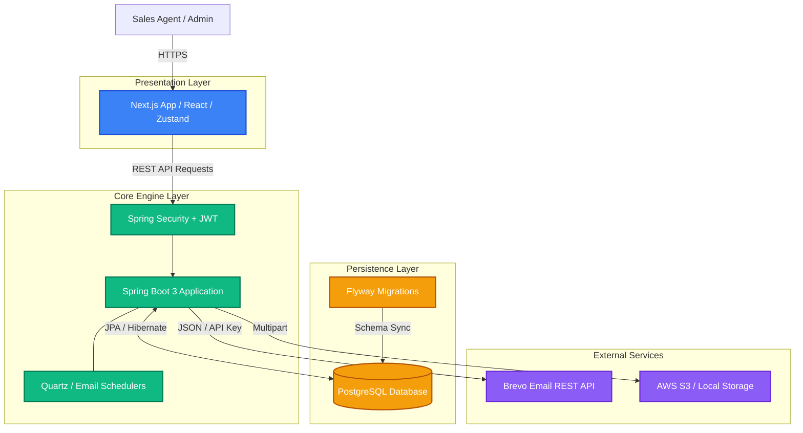
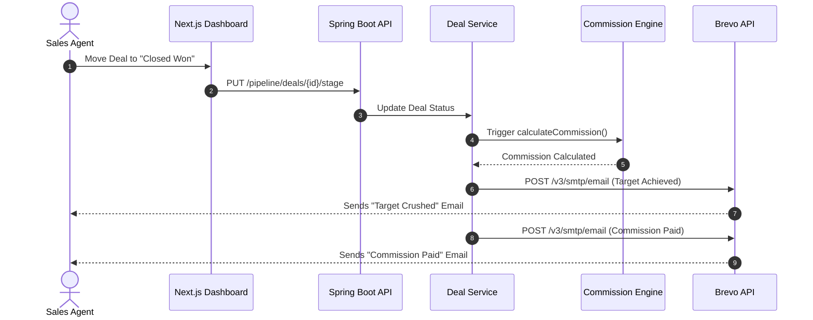

# Sales Pilot

Sales Pilot is an enterprise-grade, AI-ready CRM and Sales Engagement platform designed to streamline lead management, pipeline tracking, automated commission calculations, employee onboarding (KYC verification), and milestone incentive distribution.

Built with a decoupled architecture featuring **Next.js 14 (App Router)** on the frontend and a **Spring Boot 3** monolithic backend, Sales Pilot provides high scalability, strict data isolation, and high-performance transactional throughput.

---

## High-Level Technology Stack

### Core Frameworks & Runtime

| Layer | Technology | Version | Purpose |
| :--- | :--- | :--- | :--- |
| **Frontend Framework** | Next.js (App Router) | 14.x | Server-side rendering, client routes, and UI components |
| **Frontend Language** | TypeScript | 5.x | Static typing and type safety across all UI modules |
| **Styling & Animation** | Tailwind CSS / Framer Motion | 3.x / 11.x | Modern glassmorphism UI design system and micro-animations |
| **State Management** | Zustand | 4.x | Lightweight persistent state management |
| **Backend Framework** | Spring Boot | 3.4.x | Core application context, Dependency Injection, REST APIs |
| **Backend Language** | Java | 21 | Modern LTS Java runtime with enhanced concurrency features |
| **Security & Auth** | Spring Security | 6.x | Stateless JWT authentication, RBAC, method security |
| **Persistence Engine** | Spring Data JPA / Hibernate | 6.x | Object-relational mapping and repository abstractions |
| **Database Migrations** | Flyway | 10.x | Automated SQL schema version control and database migrations |
| **Database Engine** | PostgreSQL | 15+ | Relational data store with ACID compliance and spatial support |

### Infrastructure & External Services

| Service | Component | Description |
| :--- | :--- | :--- |
| **Email Gateway** | Brevo (Sendinblue) REST API | Transactional emails, 11-step gamified milestone triggers |
| **Video Meetings** | Jitsi Meet Engine | Stateless WebRTC online room generation and meeting links |
| **File Storage** | Database / S3 Storage Engine | Multipart upload handler for KYC docs, contracts, and avatars |
| **API Documentation**| OpenAPI 3.0 / Swagger UI | Interactive REST API endpoint exploration and specification |

---

## Key Enterprise Features

- **Automated Employee KYC & Onboarding**: Multi-stage document upload, automated validation status tracking, clarification requests, and admin verification workflows.
- **Smart Drag-and-Drop Pipeline**: Real-time pipeline Kanban board with automated stage transition handlers, stage validation rules, and owner verification.
- **Automated Commission & Payout Engine**: Real-time payout calculations, tiered commission rules, multi-currency support, and duplicate-prevention checks.
- **Gamified Incentive & Milestone System**: Automated milestone progress tracking (Deal Revenue, Won Deals, Lead Conversions), bonus claiming workflows, and sales leaderboards.
- **Secure Authentication & RBAC**: Stateless JWT architecture, short-lived tokens, multi-round Bcrypt password hashing, and role-based access control (`ADMIN`, `SALES_MANAGER`, `SALES_EXEC`).

---

## System Architecture

Sales Pilot utilizes a decoupled client-server architecture with a RESTful API layer.



---

## Core Operational Flow

Below is the event sequence triggered when a sales deal is marked as won.



---

## Setup and Installation

### 1. Prerequisites
- **Node.js**: v18.0.0 or higher
- **Java Development Kit (JDK)**: JDK 21
- **Database Engine**: PostgreSQL 15+
- **Build Tool**: Apache Maven v3.9+

### 2. Environment Configuration
Create the application configuration file by copying `.env.example`:

```bash
cp .env.example .env
```

Ensure that database credentials, `JWT_SECRET`, and email API keys (`MAIL_PASSWORD`) are properly configured.

### 3. Backend Execution
Flyway will automatically execute database migrations (`V1__` through `V23__`) upon application launch.

```bash
cd backend
./mvnw clean install -DskipTests
./mvnw spring-boot:run
```

The Spring Boot backend will bind to `http://localhost:8080/api`.

### 4. Frontend Execution
```bash
cd frontend
npm install
npm run dev
```

The Next.js user interface will be available at `http://localhost:3000`.

---

## Security Posture

- **Stateless JWT Security**: Short-lived access tokens combined with secure refresh token rotation.
- **Data Isolation**: Strict owner-lead verification preventing Unauthorized IDOR access across deals and pipelines.
- **Input Validation**: `@Valid` request body constraints on all incoming REST endpoints.
- **Bcrypt Hashing**: Password storage secured using multi-round Bcrypt hashing.
- **SQL Injection Safeguards**: 100% parameterized ORM queries via JPA/Hibernate.

---

## API Specification

Interactive Swagger UI endpoint documentation is accessible when running locally at:
`http://localhost:8080/api/swagger-ui/index.html`

---

## License

Copyright 2026 The Ripple Nexus. All rights reserved.
Proprietary and confidential. Unauthorized copying or redistribution is strictly prohibited.
