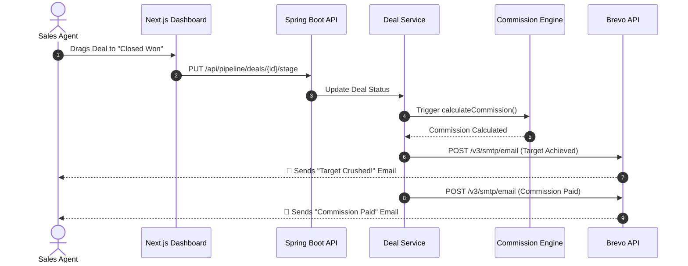

# Sales Pilot 🚀


Sales Pilot is an advanced, AI-ready CRM and Sales Engagement platform designed to streamline lead management, pipeline tracking, employee onboarding (KYC), and automated payout distribution.

Built with **Next.js 14**, **Tailwind CSS**, and **Spring Boot 3**, Sales Pilot scales flawlessly from a single founder to a massive distributed sales team.

## 🌟 Key Features

- **Automated KYC & Onboarding**: Seamlessly onboard sales agents globally with automated document verification workflows.
- **Smart Pipeline Management**: Drag-and-drop Deal pipelines with automated triggers.
- **11-Step Email Gamification Flow**: Automated Brevo-powered engagement emails to motivate employees (e.g., *First Deal Closed*, *Targets Crushed*, *Daily Agendas*).
- **Automated Commission Engine**: Real-time payout calculations, tiered commission structures, and multi-currency tracking.
- **Secure OTP Authentication**: Passwordless-ready security with robust OTP and JWT implementations.

---

## 🏗 System Architecture

Sales Pilot utilizes a modern monolithic-backend, decoupled-frontend micro-services architecture to maximize performance while retaining ease of deployment.


---

## ⚙️ Core Operational Flow

The system is designed around event-driven domain operations. Below is the automated email engagement and payout workflow triggered when a deal is won.



---

## 🚀 Getting Started

### 1. Prerequisites
- **Node.js**: v18.0.0 or higher
- **Java**: JDK 21 or higher
- **Database**: PostgreSQL 15+
- **Maven**: v3.9+

### 2. Environment Configuration
Duplicate the provided example file to create your environment configs.

```bash
cp .env.example .env
```
Ensure that `MAIL_PASSWORD` (API Key) and `JWT_SECRET` are correctly populated.

### 3. Backend Setup (Spring Boot)
The backend uses **Flyway** to automatically provision all 19+ relational tables upon startup.

```bash
cd backend
./mvnw clean install
./mvnw spring-boot:run
```
The backend will launch on `http://localhost:8080/api`

### 4. Frontend Setup (Next.js)
```bash
cd frontend
npm install
npm run dev
```
The UI will be available at `http://localhost:3000`

---

## 🔒 Security Posture

- **Stateless JWT**: Short-lived access tokens (15m) + secure HttpOnly refresh tokens.
- **Bcrypt Hashing**: Multi-round bcrypt hashing for all sensitive employee data.
- **Role-Based Access Control (RBAC)**: Strict `hasRole('ADMIN')` and `hasRole('EMPLOYEE')` enforcement via Spring Method Security.
- **SQL Injection Prevention**: 100% Hibernate parameterized queries.

---

## 📚 API Documentation

Once the backend is running, full Swagger UI documentation is available at:
`http://localhost:8080/api/swagger-ui/index.html`

## 🛡️ License

© 2026 The Ripple Nexus. All rights reserved.
Proprietary and confidential. Unauthorized copying of this file, via any medium, is strictly prohibited.
